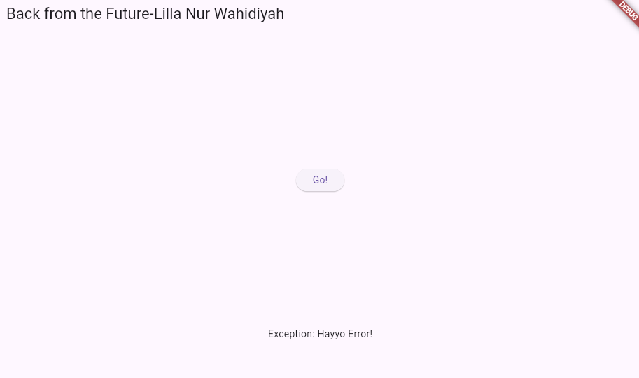

# Jobsheet 3 Pengantar Bahasa Dart - Bagian 2

## Nama       : Lilla Nur Wahidiyah
## NIM        : 2241720144
## Kelas / No : D4 TI / 17

## PRAKTIKUM 1 
### Menerapkan Control Flows (If/Else)
### Langkah 1

``` java
void main(){
String test = "test2";
if (test == "test1") {
   print("Test1");
} else If (test == "test2") {
   print("Test2");
} Else {
   print("Something else");
}

if (test == "test2") print("Test2 again");
```
### Langkah 2
Terjadi error karena huruf kapital pada penggunaan if else tidak tepat, harusnya if, else if, dan else dituliskan dalam hurus kecil semua.

### Langkah 3
``` java
String test = "true";
if (test) {
   print("Kebenaran");
}
```
 Erorr karena variabel test bertipe string, sedangkan if memerlukan tipe boolean.

Pembenaran :
```java
bool isTrue = true;
if (isTrue) {
   print("Kebenaran");
}
```

## PRAKTIKUM 2
### Menerepkan Perulangan "While" dan "Do-While"
### Langkah 1
```java
void main(){
  while (counter < 33) {
  print(counter);
  counter++;
}
}
```
### Langkah 2
Terjadi error karena variabelcounter belum dideklarasikan.
Perbaikan :
``` java
void main(){
  int counter =0; 
  while (counter < 33) {
  print(counter);
  counter++;
}
}
```
### Langkah 3
Penambahan kode
```java
void main(){
  int counter =0;
  while (counter < 33) {
  print(counter);
  counter++;
}
do {
  print(counter);
  counter++;
} while (counter < 77);
}
```
Tidak terjadi error, dan yang terjadi adalah perulangan terjadi adalah print berulang dari 0 hingga 76.

## PRAKTIKUM 3
### Menerapkan Perulangan "for" dan "break-continue"
### Langkah 1
```java
for (Index = 10; index < 27; index) {
  print(Index);
}
```
### Langkah 2
Terjadi error karena index belum dideklarasikan, dan penulisan index belum memiliki kesamaan untuk huruf kapital yang digunakan.
Perbaikan :
```java
void main(){
  int index=0;
  for (index = 10; index < 27; index) {
  print(index);
}
}
```
### Langkah 3
Tambahkan kode berikut
``` java
If (Index == 21) break;
Else If (index > 1 || index < 7) continue;
print(index);
```
## TUGAS PRAKTIKUM
```java
void main() {
  int index = 0;
  for (index = 0; index < 201; index++) {
    print(index);
    if (index % 2 == 1) {
      print("Lilla Nur Wahidiyah 2241720144");
    }
  }
}
```
Hasil

