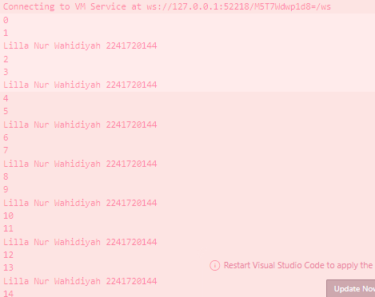

# JOBSHEET 11
# PEMROGRAMAN ASYNCHRONOUS
## Nama     : Lilla Nur Wahidiyah
## Kelas/No : D4 TI 3B / 17
## NIM      : 2241720144

## PRAKTIKUM 1
Soal 1
```java
title: const Text('Back from the Future-Lilla Nur Wahidiyah'),
```
Soal 2
Judul Buku = Bumi - Tereliye

Soal 3
Jelaskan maksud kode langkah 5 tersebut terkait substring dan catchError!
Jawab :
- Fungsi ini digunakan untuk memotong teks agar hanya mengambil sebagian dari teks yang panjangnya maksimal 450 karakter.
- Fungsi catchError digunakan untuk menangani kesalahan (error) yang mungkin terjadi selama proses getData().

Capture Hasil GIF : 

Soal 8
Perbedaan kode langkah 1 dan 4
Menggunakan FutureGroup = digunakan untuk mengelola grup Future yang dapat berubah (dinamis). Anda dapat menambahkan Future secara bertahap sebelum menutup grup, dan grup akan dianggap selesai ketika semua Future yang ditambahkan selesai.
Menggunakan FutureWait = digunakan untuk menunggu semua Future dalam daftar selesai bersamaan. Ketika semua Future selesai, ia mengembalikan sebuah Future baru yang menyimpan hasil dari semua Future yang selesai.

Soal 9
