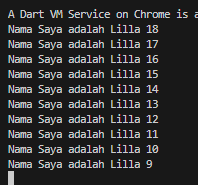
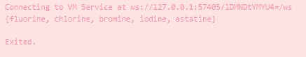
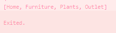
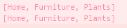
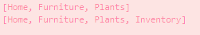

# Jobsheet 4 Pengantar Bahasa Dart - Bagian 3
## Nama     : Lilla Nur Wahidiyah
## NIM      : 2241720144
## Kelas/No : D4 TI 3B / 17

## PRAKTIKUM 1
## Eksperimen Tipe Data List
### Langkah 1
```java
void main(){
  var list =[1,2,3];
  assert(list.length == 3);
  assert(list[1] == 2);
  print(list.length);
  print(list[1]);

  list[1] = 1;
  assert(list[1] == 1);
  print(list[1]);
}
```
### Langkah 2
Hasil Run

Hasil run menunjukan 3, 2, 1
3 adalah print untuk menunjukkan panjang array
2 adalah print untuk menunjukkan nilai list untuk elemen ke 1 
1 adalah print untuk menunjukkan nilai list untuk elemen ke 1 setelah diubah

### Langkah 3
```java
  void main(){
  var list = List<dynamic>.filled(5, null);
  assert(list.length == 5);
  list[1] = "Lilla Nur Wahidiyah";
  print(list.length);
  print(list[1]);

  list[2] = 2241720144;
  assert(list[2] == 2241720144);
  print(list[2]);
}
```
Hasil :


## PRAKTIKUM 2
## Eksperimen Tipe Data Set
### Langkah 1
```java
void main(){
  var halogens = {'fluorine', 'chlorine', 'bromine', 'iodine', 'astatine'};
  print(halogens);
}
```
### Langkah 2
Yang terjadi adalah nilai variabel haloges terprint
    

### Langkah 3
```java
 var names1 = <String>{};
  names1.add("Lilla Nur Wahidiyah");
  Set<String> names2 = {}; 
  names2.add("2241720144");
  var names3 = <String>{};
  names3.addAll({"Lilla Nur Wahidiyah", "2241720144"});
  print (names1);
  print (names2);
  print (names3);
```

## PRAKTIKUM 3
## Eksperimen Tipe Data Maps
### Langkah 1
```java
void main(){
  var halogens = {'fluorine', 'chlorine', 'bromine', 'iodine', 'astatine'};
  print(halogens);

  var names1 = <String>{};
  names1.add("2241720144");
  Set<String> names2 = {"Nur","Wahidiyah","Lilla"};
  var names3 = <String>{};
  names3.addAll({"Lilla Nur Wahidiyah", "2241720144"});
  print (names1);
  print (names2);
  print (names3);
}
```
### Langkah 2
Tidak terjadi error.
Yang terjadi adalah run menunjukkan eksekusi vaiabel gifts dan nobleGases.
gifts merupakan map yang menyimpan pasangan nilai kunci-nilai yang mewakili nilai seperti hadiah. Sedangkan, nobleGases menyimpan data tentang gas mulia.
Kunci dalam map harus unik.
Hasil print :
```
Connecting to VM Service at ws://127.0.0.1:57871/KY-HMjuPDtg=/ws
{first: partridge, second: turtledoves, fifth: golden rings}
{2: helium, 10: neon, 18: argon}

Exited.
```

### Langkah 3
```java
  var mhs1 = Map<String, String>();
  gifts['first'] = 'partidge';
  gifts['second'] = 'turtledoves';
  gifts['fifth'] = 'golden rings';

  var mhs2 = Map<int, String>();
  nobleGases[2] = 'helium';
  nobleGases[10] = 'neon';
  nobleGases[18] = 'argon';
```
Perbaikan dan penambahan kode
```java
void main() {
  var gifts = {
    // Key:    Value
    'first': 'partridge',
    'second': 'turtledoves',
    'fifth': 'golden rings'
  };
  var nobleGases = {
    2: 'helium',
    10: 'neon',
    18: 'argon'
  };
  // print(gifts);
  // print(nobleGases);

  var mhs1 = <String, dynamic> {
  'nama' : 'Lilla Nur Wahidiyah',
  };

  var mhs2 = {
    'nim' : '2241720144'
  };
  print(gifts);
  print(nobleGases);
  print(mhs1);
  print(mhs2);
}

```

## PRAKTIKUM 4
## Eksperimen Tipe Data List: Spread dan Control-flow Operators
### Langkah 1
```java
void main(){
 var list = [1,2,3];
 var list2 = [0, ...list];
 print(list1);
 print(list2);
 print(list2.length);
}
```
### Langkah 2
Yang terjadi adalah error karena list1 belum dideklarasikan, variable yang dideklarasikan hanya list dan list2.
Pembenaran :
```java
void main(){
 var list1 = [1,2,3];
 var list2 = [0, ...list1];
 print(list1);
 print(list2);
 print(list2.length);
}
```
### Langkah 3
Tambahkan kode
```java
list1 = [1, 2, null];
print(list1);
var list3 = [0, ...?list1];
print(list3.length);
```
Terjadi error karena penggunaan null safety yang kurang tepat.
Pembernaran :
```java
void main() {
  var list1 = <int?>[1, 2, null];
  //var list1 = [1, 2, 3];
  var list2 = [0, ...list1];
  var list3 = [0, ...list1];
  var list4 = ["Lilla", "Nur", "Wahidiyah", "2241720144"];
  print(list1);
  print(list2);
  print(list3);
  print(list4);
  print(list1.length);
  print(list2.length);
  print(list3.length);
  print(list4.length);
}
```
### Langkah 4
```java
var nav = ['Home', 'Furniture', 'Plants', if (promoActive) 'Outlet'];
print(nav);
```
terjadi error karena perlu deklarassi promoActive terlebih dahulu yang berfungsi seperti saklar untuk menentukan apakah nilai dapat diprint atau tidak.
Pembenaran :
```java
bool promoActive = false; // Define promoActive
  var nav = ['Home', 'Furniture', 'Plants', if (promoActive) 'Outlet'];
  print(nav);
```
Hasil jika promoActive true

Hasil jika promoActive false


### Langkah 5
```java
var nav2 = ['Home', 'Furniture', 'Plants', if (login case 'Manager') 'Inventory'];
print(nav2);
```
terjadi error karena penggunakan if yang tidak tepat.
Pembenaran :
```java
var login = 'Manager'; // Define login variable
  var nav2 = [
    'Home',
    'Furniture',
    'Plants',
    if (login == 'Manager') 'Inventory'
  ];
  print(nav2);
```
Hasil print jika variabel login dengan kondisi lain :

Hasil print jika variabel login dengan kondisi yang sama :


### Langkah 6
```java
var listOfInts = [1, 2, 3];
var listOfStrings = ['#0', for (var i in listOfInts) '#$i'];
assert(listOfStrings[1] == '#1');
print(listOfStrings);
```
Tidak terjadi error, hasil print :
```
[#0, #1, #2, #3]
```
collection for dapat digunakan untuk melakukan iterasi (perulangan) melalui elemen-elemen dalam sebuah list dan sekaligus mengubahnya menjadi bentuk yang berbeda.
collection for menyediakan sintaks yang lebih ringkas dan mudah dibaca dibandingkan dengan menggunakan loop tradisional seperti for atau forEach.

## PRAKTIKUM 5
## Eksperimen Tipe Data Records
### Langkah 1
```java
var record = ('first', a: 2, b: true, 'last');
print(record)
```
### Langkah 2
Error karena tidak ada ; setelah perintah print. Pembenaran :
```java
var record = ('first', a: 2, b: true, 'last');
print(record);
```
### Langkah 3
```
void main(){
var record = ('first', a: 2, b: true, 'last');
print(record);
}
(int, int) tukar((int, int) record) {
  var (a, b) = record;
  return (b, a);
}
```
Tidak terjadi error.

### Langkah 4
Error karena variabel mahasiswa belum dideklarasikan. Pembenaran :
``` java
var mahasiswa ={
  'nama': 'Lilla Nur Wahidiyah',
  'nim': 2241710144,
  'kelas/no': 'D4 TI 3B / 17'
};
print(mahasiswa);
```

### Langkah 5
Tidak terjadi error.
Mengganti salah satu record :
```java
var mahasiswa2 = ('Lilla', a: 2241720144, b: true, 'last');

print(mahasiswa2.$1); // Prints 'first'
print(mahasiswa2.a); // Prints 2
print(mahasiswa2.b); // Prints true
print(mahasiswa2.$2); // Prints 'last'
}
(int, int) tukar((int, int) record) {
  var (a, b) = record;
  return (b, a);
}
```

## TUGAS PRAKTIKUM
1. Silakan selesaikan Praktikum 1 sampai 5, lalu dokumentasikan berupa screenshot hasil pekerjaan Anda beserta penjelasannya!
2. Jelaskan yang dimaksud Functions dalam bahasa Dart!
    Jawab :Function yaitu blok kode yang dapat digunakan untuk melakukan tugas tertentu. Fungsi memungkinkan kita untuk mengorganisir dan mengelola kode dengan lebih baik, serta memudahkan pengulangan dan pemanggilan kode yang sama tanpa perlu menulis ulang.
    Dart mendukung beberapa jenis parameter dalam fungsi:
    - Positional Parameters: Parameter yang harus diisi berdasarkan urutan.
    - Named Parameters: Parameter yang diisi dengan menyebutkan nama parameter.
    - Optional Parameters: Parameter yang tidak wajib diisi.

3. Jelaskan jenis-jenis parameter di Functions beserta contoh sintaksnya!
    Jawab :
    - Parameter posisi (parameter yang harus diberikan dalam urutan tertentu saat memanggil fungsi.)
        ```java
        void greet(String name, int age) {
         print('Hello, $name! You are $age years old.');
            }
        void main() {
            greet('Alice', 30); // Output: Hello, Alice! You are 30 years old.
            }
        ```
    - Parameter Default (memungkinkan kita untuk menentukan nilai default untuk parameter. Jika parameter tidak diberikan saat memanggil fungsi, nilai default akan digunakan.)
        ```java
        void greet(String name, [int age = 25]) {
        print('Hello, $name! You are $age years old.');
            }
        void main() {
        greet('Bob');      // Output: Hello, Bob! You are 25 years old.
        greet('Charlie', 28); // Output: Hello, Charlie! You are 28 years old.
            }
        ```

4. Jelaskan maksud Functions sebagai first-class objects beserta contoh sintaknya!
    Jawab :
    ungsi diperlakukan sebagai objek kelas pertama, artinya fungsi dapat disimpan dalam variabel, dipassing sebagai argumen, atau dikembalikan dari fungsi lain.
    Contoh Sintaks :
    ```java
        void main() {
        var greeting = (String name) => 'Hello, $name!';
        print(greeting('Dart'));
        }```
5. Apa itu Anonymous Functions? Jelaskan dan berikan contohnya!
    Jawab :
    Anonymous Functions, atau fungsi tanpa nama, adalah fungsi yang tidak memiliki nama dan biasanya digunakan untuk fungsi satu kali. Ini sering digunakan dalam callback.
    ```java
         var list = [1, 2, 3];
        var doubled = list.map((number) => number * 2);
        print(doubled.toList()); // [2, 4, 6]
    ```
6. Jelaskan perbedaan Lexical scope dan Lexical closures! Berikan contohnya!
    Jawab :
    Lexical Scope: Merujuk pada area di mana variabel dapat diakses. Dalam Dart, variabel yang dideklarasikan dalam suatu fungsi hanya dapat diakses dalam fungsi tersebut.

    Lexical Closures: Adalah fitur di mana fungsi “ingat” lingkungannya, termasuk variabel yang ada di luar fungsinya.
    Contoh Lexical Scope:
    ```java
    void main() {
    var x = 10; // x hanya dapat diakses di main
    void fungsi() {
    print(x);
     }
     fungsi(); // 10
}
```
    Contoh Lexical Closures :
    ```
     Function counter() {
     var count = 0;
     return () {
     count++;
     return count;
     };
     }
     void main() {
     var countFunction = counter();
     print(countFunction()); // 1
     print(countFunction()); // 2
     }
    ```
7. Jelaskan dengan contoh cara membuat return multiple value di Functions!
    Jawab :
    Dart tidak mendukung multiple return secara langsung, tetapi kita bisa menggunakan List atau Map, atau membuat class untuk mengembalikan beberapa nilai.
    Contoh :
    ```
    List<int> getMinMax(List<int> numbers) {
    int min = numbers.reduce((a, b) => a < b ? a : b);
    int max = numbers.reduce((a, b) => a > b ? a : b);
    return [min, max];
    }

    void main() {
    var result = getMinMax([3, 1, 4, 1, 5, 9]);
    print('Min: ${result[0]}, Max: ${result[1]}');
    }```

