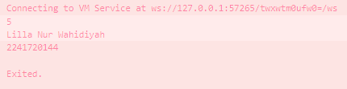

# JOBSHEET 2 PEMROGAMAN MOBILE
# Nama      : Lilla Nur Wahidiyah
# Kelas/no  : TI 3B / 
# NIM       : 2241720144


1. Modifikasilah kode pada baris 3 di VS Code atau Editor Code favorit Anda berikut ini agar mendapatkan keluaran (output) sesuai yang diminta!

```java
void main () {
    for (int i=0; i<10; i++){
        print ('hello $(i+2)');
    }
}
```
output yang diminta


Jawab :

- Kode :
```java
void main(){
  for (int i=18; i>8; i--){
    print ('Nama Saya adalah Lilla ${i}');
  }
}
```
- output :



2. Mengapa sangat penting untuk memahami bahasa pemrograman Dart sebelum kita menggunakan framework Flutter ? Jelaskan!

 Jawab :

 Karena Dart merupakan inti dari flutter. Dart sendiri merupakan bahasa pemrograman, dan Flutter merupakan sebuah framework yang hanya mendukung penggunaan bahasa pemrograman Dart. Dengan dapat memahami bahasa pemrograman dart maka juga memungkinkan untuk mengembangkan sebuah aplikasi dengan Flutter secara lebih efektif dan efisien.

3. Rangkumlah materi dari codelab ini menjadi poin-poin penting yang dapat Anda gunakan untuk membantu proses pengembangan aplikasi mobile menggunakan framework Flutter.

Jawab :
Lebih mengenal lebih dalam terkait bahasa pemrograman Dart
- evolusi yang telah dilalui dart
  bahwa dart merupakan penerus dari JavaScript yang memiliki shorctcut modern dan stabil karena telah disediakan oleh plugin IDE
- struktur dart 
  dart berprinsip object-oriented programing (OOP) dan memiliki fitur encapsulation, inheritance, composition, abstraction, dan polymorphism.
- bagaimana dart itu bekerja dengan mendukung dua jenis kompilasi:
    - Ahead-of-Time (AOT): Kode Dart dikompilasi menjadi kode mesin asli sebelum dijalankan. Ini meningkatkan kinerja aplikasi, terutama untuk aplikasi mobile seperti yang dikembangkan dengan Flutter.
    - Just-in-Time (JIT): Kode Dart dikompilasi saat runtime, yang memungkinkan perubahan kode cepat dan iterasi saat pengembangan. Ini berguna selama fase pengembangan karena mendukung fitur hot-reload, di mana perubahan kecil dapat segera dilihat tanpa kompilasi penuh.

4. Buatlah slide yang berisi penjelasan dan contoh eksekusi kode tentang perbedaan Null Safety dan Late variabel ! 

Jawab : 
https://docs.google.com/presentation/d/1Xp11Bu4mxSmJ7e9w1JCtK9lx8m4mquHy8w4GFGBvzA8/edit?usp=sharing
